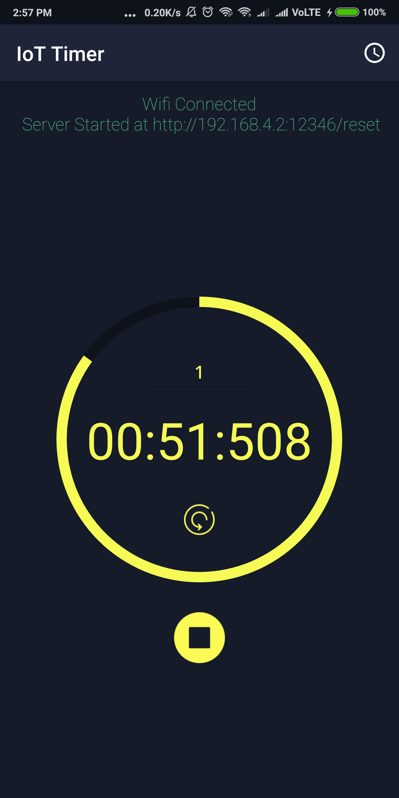

# iot_blockchain
iot_countdown_timer

resets the coundown and adds a lap when called from a "Thing" throught HTTP call

- Implments NanoHTTPD on Android
- Can be used as client or server
- IP registry at Thing 
